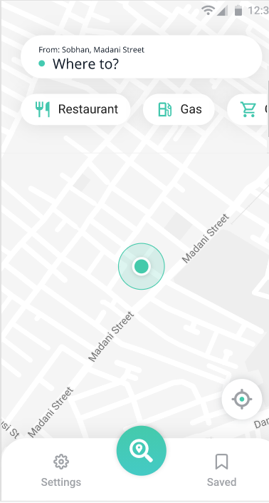
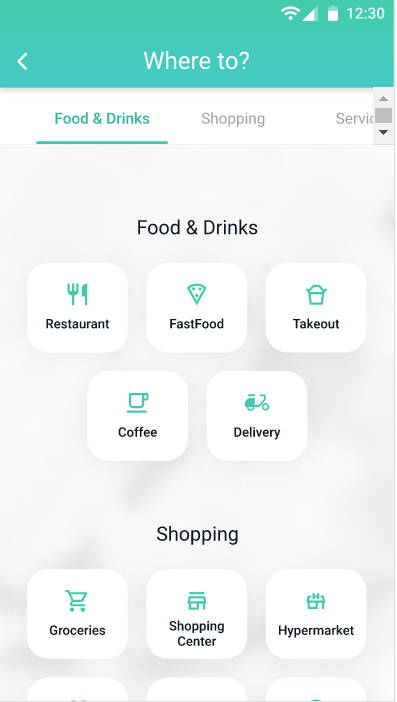
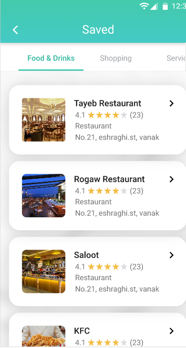
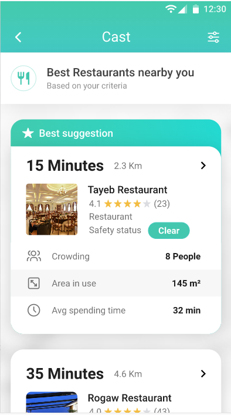

# Cast

Cast is a Flutter app that lets you know when crowded places like gas station,restaurants,markets and ... are Less crowded. 






## Technologies

- Flutter Bloc
- Google Map and Location
- Flutter Hive

## Clone repo

```
git@github.com:JAbozarOid/flutter-cast.git
```
